```mermaid
flowchart TD

LoginRoute["/login → Login"]
HomeRoute["/ → Home"]
CatalogoRoute["/catalogo → Catalogo"]
ProductoRoute["/catalogo/productos/:id → ProductoDetalle"]
InventariosRoute["/inventarios → Inventarios"]
BodegaRoute["/inventarios/bodegas/:id → BodegaDetalle"]
ProveedoresRoute["/proveedores → Proveedores"]
OrdenesRoute["/ordenes → Ordenes"]
LogisticasRoute["/logisticas → Logisticas"]
ClientesRoute["/clientes → Clientes"]
ConfigRoute["/configuracion → Configuracion"]
VentasRoute["/ventas → Ventas"]
VendedoresRoute["/ventas/vendedores → Vendedores"]
PlanesRoute["/ventas/planes → PlanesVenta"]
ReportesRoute["/ventas/reportes → ReportesVentas"]
Auth["isAuthenticated<br>from authSlice"]
Role["allowedRoles<br>from RoleBasedRoute"]

LoginRoute -->|"Roles.ADMIN"| HomeRoute
Auth -->|"true"| HomeRoute
Auth -->|"true"| CatalogoRoute
Auth -->|"true"| ProductoRoute
Auth -->|"true"| InventariosRoute
Auth -->|"true"| BodegaRoute
Auth -->|"true"| ProveedoresRoute
Auth -->|"true"| OrdenesRoute
Auth -->|"true"| LogisticasRoute
Auth -->|"true"| ClientesRoute
Auth -->|"true"| ConfigRoute
Role -->|"Roles.ADMIN"| VentasRoute
Role -->|"Roles.ADMIN"| VendedoresRoute
Role -->|"Roles.ADMIN"| PlanesRoute
Role -->|"Roles.ADMIN"| ReportesRoute
Auth -->|"true"| LoginRoute
Role -->|"Unauthorized"| HomeRoute

subgraph subGraph3 ["Route Guards"]
    Auth
    Role
    Auth -->|"true"| Role
end

subgraph subGraph2 ["Admin-Only Routes - Roles.ADMIN Required"]
    VentasRoute
    VendedoresRoute
    PlanesRoute
    ReportesRoute
end

subgraph subGraph1 ["Protected Routes - All Authenticated Users"]
    HomeRoute
    CatalogoRoute
    ProductoRoute
    InventariosRoute
    BodegaRoute
    ProveedoresRoute
    OrdenesRoute
    LogisticasRoute
    ClientesRoute
    ConfigRoute
end

subgraph subGraph0 ["Unauthenticated Routes"]
    LoginRoute
end
```

# MediSupply

Sistema de gestión de suministros médicos para clínicas y hospitales.

## Tecnologías

- React 18
- Vite
- Material UI 5 (con tema personalizado Material Design 3)
- React Router 6
- Redux Toolkit para gestión de estado
- JWT para autenticación
- Modo API real y simulada (mock)

## Requisitos previos

- Node.js (versión 16 o superior)
- npm o yarn

## Instalación

1. Clona el repositorio:
```bash
git clone <URL_DEL_REPOSITORIO>
cd Web-MediSupply-2
```

2. Instala las dependencias:
```bash
npm install
# o
yarn
```

3. Configura las variables de entorno:
   - Copia `.env.example` a `.env.mock` y `.env.real`
   - Ajusta las URLs y configuraciones según sea necesario

4. Inicia el servidor de desarrollo:

   Con APIs simuladas:
   ```bash
   npm run dev:mock
   # o
   yarn dev:mock
   ```

   Con APIs reales:
   ```bash
   npm run dev:real
   # o
   yarn dev:real
   ```

5. Abre tu navegador en `http://localhost:5173` (modo mock) o `http://localhost:5174` (modo real)

## Modos de ejecución

- **Modo Mock**: Utiliza datos simulados para desarrollo sin depender de APIs externas
- **Modo Real**: Se conecta a las APIs reales del backend

## Credenciales de prueba (modo mock)

- **Email**: `admin@medisupply.com`
- **Contraseña**: `admin123`

o

- **Email**: `test20@correo.com.co`
- **Contraseña**: `deploy1`

## Comandos disponibles

- `npm run dev`: Inicia el servidor de desarrollo con configuración por defecto
- `npm run dev:mock`: Inicia el servidor con APIs simuladas
- `npm run dev:real`: Inicia el servidor con APIs reales
- `npm run build`: Compila el proyecto para producción
- `npm run build:mock`: Compila el proyecto con APIs simuladas
- `npm run build:real`: Compila el proyecto con APIs reales
- `npm run lint`: Ejecuta el linter para encontrar problemas de código
- `npm run preview`: Previsualiza la build de producción localmente

## Estructura del proyecto

- `/src`: Código fuente de la aplicación
  - `/components`: Componentes reutilizables
    - `/auditoria`: **Componentes de auditoría reutilizables** 
      - `AuditoriaTable.jsx`: Tabla completa de auditoría
      - `AuditoriaFilters.jsx`: Sistema de filtros
      - `AuditoriaRow.jsx`: Fila expandible
      - `SeverityChip.jsx`: Chip de severidad colorizado
    - `/Navbar.jsx`: Barra de navegación lateral
    - `/ProtectedRoute.jsx`: Componente para rutas protegidas por autenticación
    - `/ApiModeIndicator.jsx`: Indicador del modo API (real o mock)
  - `/pages`: Componentes de página completa
    - `/Home.jsx`: Página de inicio
    - `/Login.jsx`: Página de autenticación
    - `/About.jsx`: Página de información
    - `/configuracion/Auditoria.jsx`: Sistema de auditoría (refactorizado) 
    - Varias páginas para cada sección (Inventario, Catálogo, etc.)
  - `/redux`: Configuración y slices de Redux
    - `/store.js`: Configuración del store
    - `/features`: Slices para cada funcionalidad
      - `/authSlice.js`: Manejo de autenticación
      - `/auditoriaSlice.js`: Gestión de auditoría 
      - `/inventarioSlice.js`: Gestión de inventario
      - `/catalogoSlice.js`: Gestión del catálogo de productos
  - `/services`: Servicios y utilidades
    - `/api.js`: Cliente API central
    - `/mockApi.js`: Simulación de APIs para desarrollo
    - `/auditoria`: Servicios de auditoría 
  - `/utils`: Utilidades compartidas
    - `/dateFormatter.js`: Formateo de fechas y tiempo relativo
  - `/theme`: Configuración del tema
    - `/theme.js`: Tema Material UI personalizado basado en Material Design 3
  - `/assets`: Recursos estáticos (imágenes, logos, etc.)
  - `/examples`: Ejemplos de uso de componentes 
  - `App.jsx`: Componente principal
  - `main.jsx`: Punto de entrada

## Variables de entorno

La aplicación utiliza diferentes archivos de entorno:

- `.env`: Configuración compartida
- `.env.mock`: Configuración para modo de simulación
- `.env.real`: Configuración para modo real

Variables principales:

- `VITE_API_BASE_URL`: URL base de la API
- `VITE_USE_MOCK_API`: `true` para usar APIs simuladas, `false` para APIs reales
- Varios `VITE_*_ENDPOINT` para diferentes rutas de la API

## Diseño y temas

El proyecto utiliza Material UI con un tema personalizado basado en Material Design 3.
El tema soporta modo claro y oscuro, que puede cambiarse desde la interfaz.


## Descripción general

> **Archivos fuente relevantes**
> * [.env.example](https://github.com/Grupo8-MediSupply/Web-MediSupply-2/blob/baf9e66d/.env.example)
> * [.gitignore](https://github.com/Grupo8-MediSupply/Web-MediSupply-2/blob/baf9e66d/.gitignore)
> * [package-lock.json](https://github.com/Grupo8-MediSupply/Web-MediSupply-2/blob/baf9e66d/package-lock.json)
> * [package.json](https://github.com/Grupo8-MediSupply/Web-MediSupply-2/blob/baf9e66d/package.json)
> * [src/App.jsx](https://github.com/Grupo8-MediSupply/Web-MediSupply-2/blob/baf9e66d/src/App.jsx)
> * [src/redux/store.js](https://github.com/Grupo8-MediSupply/Web-MediSupply-2/blob/baf9e66d/src/redux/store.js)
> * [src/services/api.js](https://github.com/Grupo8-MediSupply/Web-MediSupply-2/blob/baf9e66d/src/services/api.js)

## Propósito y alcance

Este documento ofrece una introducción de alto nivel a la aplicación web MediSupply, un sistema de gestión de la cadena de suministro médico. Cubre el propósito de la aplicación, la pila tecnológica, los patrones arquitectónicos y los dominios de negocio principales. Esta visión general está diseñada para orientar a nuevos desarrolladores y partes interesadas sobre la estructura y las capacidades del sistema.

Para información detallada sobre capas arquitectónicas específicas, consulte [Architecture](/Grupo8-MediSupply/Web-MediSupply-2/2-architecture). Para detalles de implementación de dominios de negocio individuales, consulte [Core Business Domains](/Grupo8-MediSupply/Web-MediSupply-2/3-core-business-domains). Para flujos de trabajo y buenas prácticas de desarrollo, consulte [Development Guide](/Grupo8-MediSupply/Web-MediSupply-2/6-development-guide).

**Fuentes:** [src/App.jsx L1-L203](https://github.com/Grupo8-MediSupply/Web-MediSupply-2/blob/baf9e66d/src/App.jsx#L1-L203)

---

## Propósito de la aplicación

MediSupply es un sistema web de gestión de la cadena de suministro médico que permite a los distribuidores farmacéuticos gestionar sus operaciones de extremo a extremo. La aplicación soporta las siguientes capacidades principales:

| Dominio | Funcionalidad clave | Usuarios principales |
| --- | --- | --- |
| **Catálogo de productos** | Navegar, buscar, filtrar y gestionar productos médicos (medicamentos, insumos, equipos) | Todos los usuarios autenticados |
| **Gestión de inventarios** | Rastrear niveles de stock en múltiples bodegas | Encargados de bodega, administradores |
| **Gestión de proveedores** | Mantener relaciones y datos de contacto de proveedores | Equipo de compras, administradores |
| **Operaciones de ventas** | Monitorear el desempeño y KPI del personal de ventas (vendedores) | Solo administradores |
| **Logística y rutas** | Generar rutas de entrega optimizadas y visualizarlas en mapas | Coordinadores logísticos |
| **Reportes** | Visualizar métricas de ventas, estadísticas de pedidos y paneles de rendimiento | Gerencia, administradores |

El sistema implementa control de acceso por roles; ciertas funcionalidades (ventas, reportes) están restringidas a administradores, mientras que las funciones operativas básicas están disponibles para todos los usuarios autenticados.

**Fuentes:** [src/App.jsx L119-L180](https://github.com/Grupo8-MediSupply/Web-MediSupply-2/blob/baf9e66d/src/App.jsx#L119-L180)

 [src/redux/store.js L1-L34](https://github.com/Grupo8-MediSupply/Web-MediSupply-2/blob/baf9e66d/src/redux/store.js#L1-L34)

---

## Stack tecnológico

MediSupply está construido como una aplicación de una sola página (SPA) moderna usando las siguientes tecnologías:

### Marco principal y librerías

| Tecnología | Versión | Propósito |
| --- | --- | --- |
| **React** | 18.2.0 | Framework de componentes UI |
| **Redux Toolkit** | 1.9.7 | Gestión de estado con patrones simplificados de Redux |
| **React Router** | 6.18.0 | Enrutamiento y navegación del lado del cliente |
| **Material-UI (MUI)** | 5.14.18 | Biblioteca de componentes y sistema de diseño |
| **Vite** | 4.4.5 | Herramienta de construcción y servidor de desarrollo |

### Librerías auxiliares

* **@emotion/react** & **@emotion/styled**: Solución CSS-in-JS usada por Material-UI
* **@react-google-maps/api**: Integración con Google Maps para visualización de rutas
* **jwt-decode**: Parseo de JWT para autenticación
* **redux-thunk**: Manejo de acciones asíncronas (incluido con Redux Toolkit)

### Desarrollo y pruebas

* **Vitest**: Framework de pruebas unitarias con integración de React Testing Library
* **ESLint**: Herramienta para calidad y consistencia de código
* **@vitest/coverage-v8**: Informe de cobertura de pruebas

### Modos de build

La aplicación soporta múltiples configuraciones de build mediante los modos de Vite:

```markdown
npm run dev          # Desarrollo con la configuración por defecto
npm run dev:mock     # Desarrollo con servicios API simulados
npm run dev:real     # Desarrollo con backend real
npm run build:mock   # Build de producción con servicios mock
npm run build:real   # Build de producción con backend real
```

La variable de entorno `VITE_USE_MOCK_API` controla si la aplicación usa servicios en memoria (mock) o se conecta a endpoints reales, permitiendo desarrollo full-stack sin dependencia del backend.

**Fuentes:** [package.json L1-L51](https://github.com/Grupo8-MediSupply/Web-MediSupply-2/blob/baf9e66d/package.json#L1-L51)

 [.env.example L1-L27](https://github.com/Grupo8-MediSupply/Web-MediSupply-2/blob/baf9e66d/.env.example#L1-L27)

---

## Arquitectura de alto nivel

MediSupply sigue una arquitectura de tres capas con separación clara de responsabilidades entre la presentación, la gestión del estado y la capa de servicios.

### Diagrama de arquitectura: capas del sistema

```mermaid
flowchart TD

App["App.jsx<br>Router & Layout"]
Navbar["Navbar<br>Navigation & Theme Toggle"]
Catalogo["Catalogo<br>/catalogo"]
ProductoDetalle["ProductoDetalle<br>/catalogo/productos/:id"]
Inventarios["Inventarios<br>/inventarios"]
BodegaDetalle["BodegaDetalle<br>/inventarios/bodegas/:id"]
Proveedores["Proveedores<br>/proveedores"]
Vendedores["Vendedores<br>/ventas/vendedores"]
Logisticas["Logisticas<br>/logisticas"]
Login["Login<br>/login"]
ProtectedRoute["ProtectedRoute<br>Authentication Check"]
RoleBasedRoute["RoleBasedRoute<br>Authorization Check"]
Store["configureStore()<br>Redux Store"]
CatalogoSlice["catalogoSlice<br>Products & Catalog"]
BodegasSlice["bodegasSlice<br>Warehouses"]
ProveedoresSlice["proveedoresSlice<br>Suppliers"]
VendedoresSlice["vendedoresSlice<br>Sales Personnel"]
LogisticaSlice["logisticaSlice<br>Delivery Routes"]
AuthSlice["authSlice<br>Authentication"]
ConfigSlice["configuracionSlice<br>Country/Region Settings"]
ReportesSlice["reportesSlice<br>KPIs & Metrics"]
PlanesVentaSlice["planesVentaSlice<br>Sales Plans"]
API["api.js<br>Service Aggregator"]
CatalogoSvc["catalogoService<br>Mock/Real Toggle"]
ProveedoresSvc["proveedoresService<br>Mock/Real Toggle"]
VendedoresSvc["vendedoresService"]
LogisticaSvc["logisticaService<br>Mock/Real Toggle"]
AuthSvc["authService"]
ReportesSvc["reportesService<br>Mock/Real Toggle"]
PlanesVentaSvc["planesVentaService"]
Backend["Backend REST API<br>Multiple Microservices"]
Storage["localStorage<br>JWT Tokens"]
GoogleMaps["Google Maps API<br>Route Visualization"]

Catalogo --> CatalogoSlice
ProductoDetalle --> CatalogoSlice
Inventarios --> BodegasSlice
BodegaDetalle --> BodegasSlice
Proveedores --> ProveedoresSlice
Vendedores --> VendedoresSlice
Logisticas --> LogisticaSlice
Login --> AuthSlice
Navbar --> ReportesSlice
CatalogoSlice --> API
ProveedoresSlice --> API
VendedoresSlice --> API
LogisticaSlice --> API
AuthSlice --> API
ReportesSlice --> API
CatalogoSvc --> Backend
ProveedoresSvc --> Backend
VendedoresSvc --> Backend
LogisticaSvc --> Backend
AuthSvc --> Backend
ReportesSvc --> Backend
PlanesVentaSvc --> Backend
AuthSlice --> Storage
Logisticas --> GoogleMaps

subgraph subGraph7 ["External Systems"]
  Backend
  Storage
  GoogleMaps
end

subgraph subGraph6 ["Service Layer"]
  API
  API --> CatalogoSvc
  API --> ProveedoresSvc
  API --> VendedoresSvc
  API --> LogisticaSvc
  API --> AuthSvc
  API --> ReportesSvc
  API --> PlanesVentaSvc

subgraph subGraph5 ["Domain Services"]
  CatalogoSvc
  ProveedoresSvc
  VendedoresSvc
  LogisticaSvc
  AuthSvc
  ReportesSvc
  PlanesVentaSvc
end
end

subgraph subGraph4 ["State Management Layer"]
  Store
  Store --> CatalogoSlice
  Store --> BodegasSlice
  Store --> ProveedoresSlice
  Store --> VendedoresSlice
  Store --> LogisticaSlice
  Store --> AuthSlice
  Store --> ConfigSlice
  Store --> ReportesSlice
  Store --> PlanesVentaSlice

subgraph subGraph3 ["Domain Slices"]
  CatalogoSlice
  BodegasSlice
  ProveedoresSlice
  VendedoresSlice
  LogisticaSlice
  AuthSlice
  ConfigSlice
  ReportesSlice
  PlanesVentaSlice
end
end

subgraph subGraph2 ["Presentation Layer"]
  App
  Navbar
  App --> Navbar
  App --> Catalogo
  App --> ProductoDetalle
  App --> Inventarios
  App --> BodegaDetalle
  App --> Proveedores
  App --> Vendedores
  App --> Logisticas
  App --> Login
  App --> ProtectedRoute
  App --> RoleBasedRoute

subgraph subGraph1 ["Route Protection"]
  ProtectedRoute
  RoleBasedRoute
end

subgraph subGraph0 ["Feature Pages"]
  Catalogo
  ProductoDetalle
  Inventarios
  BodegaDetalle
  Proveedores
  Vendedores
  Logisticas
  Login
end
end
```




### Layer Responsibilities

#### Presentation Layer

The presentation layer is orchestrated by `App.jsx`, which configures the React Router, manages theme state via `ColorModeContext`, and applies Material-UI's `ThemeProvider`. The layout adapts based on authentication state:

* **Authenticated Layout**: Displays `Navbar` (drawer navigation), `MainAppBar` (top bar), and renders protected routes
* **Unauthenticated Layout**: Shows only the `Login` page, redirecting all other routes to `/login`

Route protection is enforced at two levels:

1. `ProtectedRoute`: Checks `isAuthenticated` from `authSlice` state
2. `RoleBasedRoute`: Validates user roles (e.g., `Roles.ADMIN` for sales features)

Feature pages are domain-specific views (e.g., `Catalogo`, `Inventarios`, `Proveedores`) that dispatch Redux actions and consume state via `useSelector` and `useDispatch` hooks.

**Sources:** [src/App.jsx L85-L201](https://github.com/Grupo8-MediSupply/Web-MediSupply-2/blob/baf9e66d/src/App.jsx#L85-L201)

#### State Management Layer

State management uses Redux Toolkit with a domain-driven slice architecture. The `configureStore()` function in [src/redux/store.js](https://github.com/Grupo8-MediSupply/Web-MediSupply-2/blob/baf9e66d/src/redux/store.js)

 configures 10 domain-specific reducers:

| Slice | State Domain | Key Responsibilities |
| --- | --- | --- |
| `catalogoSlice` | Product catalog | Product CRUD, search, filtering, batch requests |
| `bodegasSlice` | Warehouses | Warehouse list, inventory levels |
| `proveedoresSlice` | Suppliers | Supplier CRUD, country filtering |
| `vendedoresSlice` | Sales personnel | Vendor list, assignments |
| `logisticaSlice` | Logistics | Delivery orders, route generation |
| `authSlice` | Authentication | JWT tokens, user data, login/logout |
| `configuracionSlice` | Configuration | Country/region settings, app initialization |
| `reportesSlice` | Reports | Sales KPIs, performance metrics |
| `planesVentaSlice` | Sales plans | Sales planning data |

Each slice implements `createAsyncThunk` actions for API interactions, automatically managing `loading`, `succeeded`, and `failed` states. The store configuration includes custom middleware to handle non-serializable values (JWT tokens) in the authentication slice.

**Sources:** [src/redux/store.js L1-L34](https://github.com/Grupo8-MediSupply/Web-MediSupply-2/blob/baf9e66d/src/redux/store.js#L1-L34)

#### Service Layer

The service layer abstracts backend communication and implements a mock/real dual-implementation pattern. The `api.js` aggregator exports all services grouped by domain:

```javascript
export const api = {
  auth: authService,
  vendedores: vendedoresService,
  proveedores: proveedoresService,
  catalogo: catalogoService,
  reportes: reportesService,
  logistica: logisticaService,
  planesVenta: planesVentaService,
};
```

Each service has two implementations:

* **Mock Service**: Returns in-memory data with simulated network latency (500-1200ms)
* **Real Service**: Makes HTTP requests to backend REST APIs

The `VITE_USE_MOCK_API` environment variable controls which implementation is exported, enabling development without backend dependencies. See [Service Layer & API Integration](/Grupo8-MediSupply/Web-MediSupply-2/2.3-service-layer-and-api-integration) for details.

**Sources:** [src/services/api.js L1-L31](https://github.com/Grupo8-MediSupply/Web-MediSupply-2/blob/baf9e66d/src/services/api.js#L1-L31)

 [.env.example L23](https://github.com/Grupo8-MediSupply/Web-MediSupply-2/blob/baf9e66d/.env.example#L23-L23)

---

## Application Structure and Routing

The following diagram maps the application's route structure to specific page components and their authentication requirements:

### Route Structure Diagram



**Sources:** [src/App.jsx L118-L180](https://github.com/Grupo8-MediSupply/Web-MediSupply-2/blob/baf9e66d/src/App.jsx#L118-L180)

 [src/App.jsx L13-L14](https://github.com/Grupo8-MediSupply/Web-MediSupply-2/blob/baf9e66d/src/App.jsx#L13-L14)

### Route Protection Implementation

Routes are protected using two wrapper components:

1. **ProtectedRoute**: Checks `isAuthenticated` from Redux state. If false, redirects to `/login`. Wraps all non-login routes.
2. **RoleBasedRoute**: Checks user roles against `allowedRoles` prop. Used for admin-only features: ```xml <RoleBasedRoute allowedRoles={[Roles.ADMIN]}>   <Vendedores /> </RoleBasedRoute> ```

The `Roles` constant is imported from `src/constants/auth` and defines available role identifiers.

**Sources:** [src/App.jsx L13-L15](https://github.com/Grupo8-MediSupply/Web-MediSupply-2/blob/baf9e66d/src/App.jsx#L13-L15)

 [src/App.jsx L131-L170](https://github.com/Grupo8-MediSupply/Web-MediSupply-2/blob/baf9e66d/src/App.jsx#L131-L170)

---

## Domain-Driven Design

MediSupply implements domain-driven design with six primary business domains, each maintaining its own:

* **UI Pages**: Feature-specific views and detail pages
* **Redux Slice**: Domain state management with async thunks
* **Service Module**: API communication with mock/real implementations

### Domain Overview Table

| Domain | Redux Slice | Service Module | Primary Pages | Access Level |
| --- | --- | --- | --- | --- |
| **Product Catalog** | `catalogoSlice` | `catalogoService` | `Catalogo`, `ProductoDetalle` | All users |
| **Inventory** | `bodegasSlice` | `bodegasService` | `Inventarios`, `BodegaDetalle` | All users |
| **Suppliers** | `proveedoresSlice` | `proveedoresService` | `Proveedores` | All users |
| **Sales** | `vendedoresSlice` | `vendedoresService` | `Vendedores`, `ReportesVentas`, `PlanesVenta` | Admin only |
| **Logistics** | `logisticaSlice` | `logisticaService` | `Logisticas` | All users |
| **Reporting** | `reportesSlice` | `reportesService` | Navbar metrics | All users |

### Cross-Cutting Concerns

Two domains serve cross-cutting purposes:

1. **Authentication** (`authSlice`, `authService`): Manages user identity, JWT tokens, login/logout flows
2. **Configuration** (`configuracionSlice`, `configuracionService`): Provides country/region settings required by multiple domains

The `configuracionSlice` is a foundational dependency - it must be loaded before other domains can fetch country-specific data.

For detailed information about each domain's implementation, see [Core Business Domains](/Grupo8-MediSupply/Web-MediSupply-2/3-core-business-domains).

**Sources:** [src/redux/store.js L1-L34](https://github.com/Grupo8-MediSupply/Web-MediSupply-2/blob/baf9e66d/src/redux/store.js#L1-L34)

 [src/services/api.js L1-L31](https://github.com/Grupo8-MediSupply/Web-MediSupply-2/blob/baf9e66d/src/services/api.js#L1-L31)

---

## Development Environment

### Environment Configuration

The application uses Vite's environment variable system with the `VITE_` prefix. Key configuration variables:

| Variable | Purpose | Example Value |
| --- | --- | --- |
| `VITE_API_BASE_URL` | Backend API gateway URL | `https://api-gateway-url-here` |
| `VITE_USE_MOCK_API` | Toggle mock/real services | `true` or `false` |
| `VITE_GOOGLE_MAPS_API_KEY` | Google Maps integration | API key string |
| `VITE_*_ENDPOINT` | Resource-specific endpoints | `/products`, `/suppliers`, etc. |

A development mode indicator (`ApiModeIndicator`) displays when `import.meta.env.DEV` is true, showing whether the application is using mock or real services.

**Sources:** [.env.example L1-L27](https://github.com/Grupo8-MediSupply/Web-MediSupply-2/blob/baf9e66d/.env.example#L1-L27)

 [src/App.jsx L183-L194](https://github.com/Grupo8-MediSupply/Web-MediSupply-2/blob/baf9e66d/src/App.jsx#L183-L194)

### Build and Development Scripts

```markdown
# Development
npm run dev          # Default mode
npm run dev:mock     # Force mock API
npm run dev:real     # Force real API

# Production builds
npm run build        # Default production build
npm run build:mock   # Production with mock services
npm run build:real   # Production with real backend

# Testing
npm run test         # Run test suite once
npm run test:watch   # Watch mode
npm run test:coverage # Generate coverage report
```

The Vite build tool provides:

* Fast hot module replacement (HMR) during development
* Optimized production builds with code splitting
* Environment-specific builds via `--mode` flag

**Sources:** [package.json L6-L18](https://github.com/Grupo8-MediSupply/Web-MediSupply-2/blob/baf9e66d/package.json#L6-L18)

---

## Key Integration Points

### Google Maps Integration

The logistics domain integrates with Google Maps API for route visualization:

* **Component**: `MapaRutas` (referenced in `Logisticas` page)
* **Library**: `@react-google-maps/api`
* **Configuration**: `VITE_GOOGLE_MAPS_API_KEY` environment variable

Routes are displayed with polylines, markers for vehicles, warehouses, and customer locations.

**Sources:** [package.json L24](https://github.com/Grupo8-MediSupply/Web-MediSupply-2/blob/baf9e66d/package.json#L24-L24)

 [.env.example L26](https://github.com/Grupo8-MediSupply/Web-MediSupply-2/blob/baf9e66d/.env.example#L26-L26)

### Backend API Communication

Real services (when `VITE_USE_MOCK_API=false`) communicate with backend microservices via:

* RESTful HTTP endpoints configured per resource type
* JWT bearer token authentication (managed by `authService`)
* Response format: `{ success: boolean, result: any }`

The service layer handles token attachment, error handling, and response normalization.

**Sources:** [src/services/api.js L1-L31](https://github.com/Grupo8-MediSupply/Web-MediSupply-2/blob/baf9e66d/src/services/api.js#L1-L31)

 [.env.example L1-L19](https://github.com/Grupo8-MediSupply/Web-MediSupply-2/blob/baf9e66d/.env.example#L1-L19)

### Local Storage Usage

The application persists two types of data to `localStorage`:

1. **Authentication Tokens**: JWT access tokens stored by `authSlice`, used for session restoration
2. **Theme Preference**: Light/dark mode selection stored by `App.jsx`

**Sources:** [src/App.jsx L55-L69](https://github.com/Grupo8-MediSupply/Web-MediSupply-2/blob/baf9e66d/src/App.jsx#L55-L69)

 [src/redux/store.js L28-L32](https://github.com/Grupo8-MediSupply/Web-MediSupply-2/blob/baf9e66d/src/redux/store.js#L28-L32)

---

## Next Steps

This overview provides a foundation for understanding MediSupply's architecture and capabilities. For more detailed information:

* **Architecture Details**: See [Architecture](/Grupo8-MediSupply/Web-MediSupply-2/2-architecture) for in-depth explanations of each layer
* **Domain Implementation**: See [Core Business Domains](/Grupo8-MediSupply/Web-MediSupply-2/3-core-business-domains) for comprehensive domain-specific documentation
* **UI Components**: See [User Interface Components](/Grupo8-MediSupply/Web-MediSupply-2/4-user-interface-components) for reusable component patterns
* **Development Workflows**: See [Development Guide](/Grupo8-MediSupply/Web-MediSupply-2/6-development-guide) for practical development instructions

**Sources:** [src/App.jsx L1-L203](https://github.com/Grupo8-MediSupply/Web-MediSupply-2/blob/baf9e66d/src/App.jsx#L1-L203)

 [src/redux/store.js L1-L34](https://github.com/Grupo8-MediSupply/Web-MediSupply-2/blob/baf9e66d/src/redux/store.js#L1-L34)

 [src/services/api.js L1-L31](https://github.com/Grupo8-MediSupply/Web-MediSupply-2/blob/baf9e66d/src/services/api.js#L1-L31)

 [package.json L1-L51](https://github.com/Grupo8-MediSupply/Web-MediSupply-2/blob/baf9e66d/package.json#L1-L51)
