# MediSupply

Sistema de gestión de suministros médicos para clínicas y hospitales.

## Tecnologías

- React 18
- Vite
- Material UI 5 (con tema personalizado Material Design 3)
- React Router 6
- Redux Toolkit para gestión de estado
- JWT para autenticación
- Modo API real y simulada (mock)

## Requisitos previos

- Node.js (versión 16 o superior)
- npm o yarn

## Instalación

1. Clona el repositorio:
```bash
git clone <URL_DEL_REPOSITORIO>
cd Web-MediSupply-2
```

2. Instala las dependencias:
```bash
npm install
# o
yarn
```

3. Configura las variables de entorno:
   - Copia `.env.example` a `.env.mock` y `.env.real`
   - Ajusta las URLs y configuraciones según sea necesario

4. Inicia el servidor de desarrollo:

   Con APIs simuladas:
   ```bash
   npm run dev:mock
   # o
   yarn dev:mock
   ```

   Con APIs reales:
   ```bash
   npm run dev:real
   # o
   yarn dev:real
   ```

5. Abre tu navegador en `http://localhost:5173` (modo mock) o `http://localhost:5174` (modo real)

## Modos de ejecución

- **Modo Mock**: Utiliza datos simulados para desarrollo sin depender de APIs externas
- **Modo Real**: Se conecta a las APIs reales del backend

## Credenciales de prueba (modo mock)

- **Email**: `admin@medisupply.com`
- **Contraseña**: `admin123`

o

- **Email**: `test20@correo.com.co`
- **Contraseña**: `deploy1`

## Comandos disponibles

- `npm run dev`: Inicia el servidor de desarrollo con configuración por defecto
- `npm run dev:mock`: Inicia el servidor con APIs simuladas
- `npm run dev:real`: Inicia el servidor con APIs reales
- `npm run build`: Compila el proyecto para producción
- `npm run build:mock`: Compila el proyecto con APIs simuladas
- `npm run build:real`: Compila el proyecto con APIs reales
- `npm run lint`: Ejecuta el linter para encontrar problemas de código
- `npm run preview`: Previsualiza la build de producción localmente

## Estructura del proyecto

- `/src`: Código fuente de la aplicación
  - `/components`: Componentes reutilizables
    - `/auditoria`: **Componentes de auditoría reutilizables** 
      - `AuditoriaTable.jsx`: Tabla completa de auditoría
      - `AuditoriaFilters.jsx`: Sistema de filtros
      - `AuditoriaRow.jsx`: Fila expandible
      - `SeverityChip.jsx`: Chip de severidad colorizado
    - `/Navbar.jsx`: Barra de navegación lateral
    - `/ProtectedRoute.jsx`: Componente para rutas protegidas por autenticación
    - `/ApiModeIndicator.jsx`: Indicador del modo API (real o mock)
  - `/pages`: Componentes de página completa
    - `/Home.jsx`: Página de inicio
    - `/Login.jsx`: Página de autenticación
    - `/About.jsx`: Página de información
    - `/configuracion/Auditoria.jsx`: Sistema de auditoría (refactorizado) 
    - Varias páginas para cada sección (Inventario, Catálogo, etc.)
  - `/redux`: Configuración y slices de Redux
    - `/store.js`: Configuración del store
    - `/features`: Slices para cada funcionalidad
      - `/authSlice.js`: Manejo de autenticación
      - `/auditoriaSlice.js`: Gestión de auditoría 
      - `/inventarioSlice.js`: Gestión de inventario
      - `/catalogoSlice.js`: Gestión del catálogo de productos
  - `/services`: Servicios y utilidades
    - `/api.js`: Cliente API central
    - `/mockApi.js`: Simulación de APIs para desarrollo
    - `/auditoria`: Servicios de auditoría 
  - `/utils`: Utilidades compartidas
    - `/dateFormatter.js`: Formateo de fechas y tiempo relativo
  - `/theme`: Configuración del tema
    - `/theme.js`: Tema Material UI personalizado basado en Material Design 3
  - `/assets`: Recursos estáticos (imágenes, logos, etc.)
  - `/examples`: Ejemplos de uso de componentes 
  - `App.jsx`: Componente principal
  - `main.jsx`: Punto de entrada

## Variables de entorno

La aplicación utiliza diferentes archivos de entorno:

- `.env`: Configuración compartida
- `.env.mock`: Configuración para modo de simulación
- `.env.real`: Configuración para modo real

Variables principales:

- `VITE_API_BASE_URL`: URL base de la API
- `VITE_USE_MOCK_API`: `true` para usar APIs simuladas, `false` para APIs reales
- Varios `VITE_*_ENDPOINT` para diferentes rutas de la API

## Diseño y temas

El proyecto utiliza Material UI con un tema personalizado basado en Material Design 3.
El tema soporta modo claro y oscuro, que puede cambiarse desde la interfaz.


## Descripción general

> **Archivos fuente relevantes**
> * [.env.example](https://github.com/Grupo8-MediSupply/Web-MediSupply-2/blob/baf9e66d/.env.example)
> * [.gitignore](https://github.com/Grupo8-MediSupply/Web-MediSupply-2/blob/baf9e66d/.gitignore)
> * [package-lock.json](https://github.com/Grupo8-MediSupply/Web-MediSupply-2/blob/baf9e66d/package-lock.json)
> * [package.json](https://github.com/Grupo8-MediSupply/Web-MediSupply-2/blob/baf9e66d/package.json)
> * [src/App.jsx](https://github.com/Grupo8-MediSupply/Web-MediSupply-2/blob/baf9e66d/src/App.jsx)
> * [src/redux/store.js](https://github.com/Grupo8-MediSupply/Web-MediSupply-2/blob/baf9e66d/src/redux/store.js)
> * [src/services/api.js](https://github.com/Grupo8-MediSupply/Web-MediSupply-2/blob/baf9e66d/src/services/api.js)

## Propósito y alcance

Este documento ofrece una introducción de alto nivel a la aplicación web MediSupply, un sistema de gestión de la cadena de suministro médico. Cubre el propósito de la aplicación, la pila tecnológica, los patrones arquitectónicos y los dominios de negocio principales. Esta visión general está diseñada para orientar a nuevos desarrolladores y partes interesadas sobre la estructura y las capacidades del sistema.

Para información detallada sobre capas arquitectónicas específicas, consulte [Architecture](/Grupo8-MediSupply/Web-MediSupply-2/2-architecture). Para detalles de implementación de dominios de negocio individuales, consulte [Core Business Domains](/Grupo8-MediSupply/Web-MediSupply-2/3-core-business-domains). Para flujos de trabajo y buenas prácticas de desarrollo, consulte [Development Guide](/Grupo8-MediSupply/Web-MediSupply-2/6-development-guide).

**Fuentes:** [src/App.jsx L1-L203](https://github.com/Grupo8-MediSupply/Web-MediSupply-2/blob/baf9e66d/src/App.jsx#L1-L203)

---

## Propósito de la aplicación

MediSupply es un sistema web de gestión de la cadena de suministro médico que permite a los distribuidores farmacéuticos gestionar sus operaciones de extremo a extremo. La aplicación soporta las siguientes capacidades principales:

| Dominio | Funcionalidad clave | Usuarios principales |
| --- | --- | --- |
| **Catálogo de productos** | Navegar, buscar, filtrar y gestionar productos médicos (medicamentos, insumos, equipos) | Todos los usuarios autenticados |
| **Gestión de inventarios** | Rastrear niveles de stock en múltiples bodegas | Encargados de bodega, administradores |
| **Gestión de proveedores** | Mantener relaciones y datos de contacto de proveedores | Equipo de compras, administradores |
| **Operaciones de ventas** | Monitorear el desempeño y KPI del personal de ventas (vendedores) | Solo administradores |
| **Logística y rutas** | Generar rutas de entrega optimizadas y visualizarlas en mapas | Coordinadores logísticos |
| **Reportes** | Visualizar métricas de ventas, estadísticas de pedidos y paneles de rendimiento | Gerencia, administradores |

El sistema implementa control de acceso por roles; ciertas funcionalidades (ventas, reportes) están restringidas a administradores, mientras que las funciones operativas básicas están disponibles para todos los usuarios autenticados.

**Fuentes:** [src/App.jsx L119-L180](https://github.com/Grupo8-MediSupply/Web-MediSupply-2/blob/baf9e66d/src/App.jsx#L119-L180)

 [src/redux/store.js L1-L34](https://github.com/Grupo8-MediSupply/Web-MediSupply-2/blob/baf9e66d/src/redux/store.js#L1-L34)

---

## Stack tecnológico

MediSupply está construido como una aplicación de una sola página (SPA) moderna usando las siguientes tecnologías:

### Marco principal y librerías

| Tecnología | Versión | Propósito |
| --- | --- | --- |
| **React** | 18.2.0 | Framework de componentes UI |
| **Redux Toolkit** | 1.9.7 | Gestión de estado con patrones simplificados de Redux |
| **React Router** | 6.18.0 | Enrutamiento y navegación del lado del cliente |
| **Material-UI (MUI)** | 5.14.18 | Biblioteca de componentes y sistema de diseño |
| **Vite** | 4.4.5 | Herramienta de construcción y servidor de desarrollo |

### Librerías auxiliares

* **@emotion/react** & **@emotion/styled**: Solución CSS-in-JS usada por Material-UI
* **@react-google-maps/api**: Integración con Google Maps para visualización de rutas
* **jwt-decode**: Parseo de JWT para autenticación
* **redux-thunk**: Manejo de acciones asíncronas (incluido con Redux Toolkit)

### Desarrollo y pruebas

* **Vitest**: Framework de pruebas unitarias con integración de React Testing Library
* **ESLint**: Herramienta para calidad y consistencia de código
* **@vitest/coverage-v8**: Informe de cobertura de pruebas

### Modos de build

La aplicación soporta múltiples configuraciones de build mediante los modos de Vite:

```markdown
npm run dev          # Desarrollo con la configuración por defecto
npm run dev:mock     # Desarrollo con servicios API simulados
npm run dev:real     # Desarrollo con backend real
npm run build:mock   # Build de producción con servicios mock
npm run build:real   # Build de producción con backend real
```

La variable de entorno `VITE_USE_MOCK_API` controla si la aplicación usa servicios en memoria (mock) o se conecta a endpoints reales, permitiendo desarrollo full-stack sin dependencia del backend.

**Fuentes:** [package.json L1-L51](https://github.com/Grupo8-MediSupply/Web-MediSupply-2/blob/baf9e66d/package.json#L1-L51)

 [.env.example L1-L27](https://github.com/Grupo8-MediSupply/Web-MediSupply-2/blob/baf9e66d/.env.example#L1-L27)

---

## Arquitectura de alto nivel

MediSupply sigue una arquitectura de tres capas con separación clara de responsabilidades entre la presentación, la gestión del estado y la capa de servicios.

### Diagrama de arquitectura: capas del sistema

```mermaid
flowchart TD

App["App.jsx<br>Router & Layout"]
Navbar["Navbar<br>Navigation & Theme Toggle"]
Catalogo["Catalogo<br>/catalogo"]
ProductoDetalle["ProductoDetalle<br>/catalogo/productos/:id"]
Inventarios["Inventarios<br>/inventarios"]
BodegaDetalle["BodegaDetalle<br>/inventarios/bodegas/:id"]
Proveedores["Proveedores<br>/proveedores"]
Vendedores["Vendedores<br>/ventas/vendedores"]
Logisticas["Logisticas<br>/logisticas"]
Login["Login<br>/login"]
ProtectedRoute["ProtectedRoute<br>Authentication Check"]
RoleBasedRoute["RoleBasedRoute<br>Authorization Check"]
Store["configureStore()<br>Redux Store"]
CatalogoSlice["catalogoSlice<br>Products & Catalog"]
BodegasSlice["bodegasSlice<br>Warehouses"]
ProveedoresSlice["proveedoresSlice<br>Suppliers"]
VendedoresSlice["vendedoresSlice<br>Sales Personnel"]
LogisticaSlice["logisticaSlice<br>Delivery Routes"]
AuthSlice["authSlice<br>Authentication"]
ConfigSlice["configuracionSlice<br>Country/Region Settings"]
ReportesSlice["reportesSlice<br>KPIs & Metrics"]
PlanesVentaSlice["planesVentaSlice<br>Sales Plans"]
API["api.js<br>Service Aggregator"]
CatalogoSvc["catalogoService<br>Mock/Real Toggle"]
ProveedoresSvc["proveedoresService<br>Mock/Real Toggle"]
VendedoresSvc["vendedoresService"]
LogisticaSvc["logisticaService<br>Mock/Real Toggle"]
AuthSvc["authService"]
ReportesSvc["reportesService<br>Mock/Real Toggle"]
PlanesVentaSvc["planesVentaService"]
Backend["Backend REST API<br>Multiple Microservices"]
Storage["localStorage<br>JWT Tokens"]
GoogleMaps["Google Maps API<br>Route Visualization"]

Catalogo --> CatalogoSlice
ProductoDetalle --> CatalogoSlice
Inventarios --> BodegasSlice
BodegaDetalle --> BodegasSlice
Proveedores --> ProveedoresSlice
Vendedores --> VendedoresSlice
Logisticas --> LogisticaSlice
Login --> AuthSlice
Navbar --> ReportesSlice
CatalogoSlice --> API
ProveedoresSlice --> API
VendedoresSlice --> API
LogisticaSlice --> API
AuthSlice --> API
ReportesSlice --> API
CatalogoSvc --> Backend
ProveedoresSvc --> Backend
VendedoresSvc --> Backend
LogisticaSvc --> Backend
AuthSvc --> Backend
ReportesSvc --> Backend
PlanesVentaSvc --> Backend
AuthSlice --> Storage
Logisticas --> GoogleMaps

subgraph subGraph7 ["External Systems"]
  Backend
  Storage
  GoogleMaps
end

subgraph subGraph6 ["Service Layer"]
  API
  API --> CatalogoSvc
  API --> ProveedoresSvc
  API --> VendedoresSvc
  API --> LogisticaSvc
  API --> AuthSvc
  API --> ReportesSvc
  API --> PlanesVentaSvc

subgraph subGraph5 ["Domain Services"]
  CatalogoSvc
  ProveedoresSvc
  VendedoresSvc
  LogisticaSvc
  AuthSvc
  ReportesSvc
  PlanesVentaSvc
end
end

subgraph subGraph4 ["State Management Layer"]
  Store
  Store --> CatalogoSlice
  Store --> BodegasSlice
  Store --> ProveedoresSlice
  Store --> VendedoresSlice
  Store --> LogisticaSlice
  Store --> AuthSlice
  Store --> ConfigSlice
  Store --> ReportesSlice
  Store --> PlanesVentaSlice

subgraph subGraph3 ["Domain Slices"]
  CatalogoSlice
  BodegasSlice
  ProveedoresSlice
  VendedoresSlice
  LogisticaSlice
  AuthSlice
  ConfigSlice
  ReportesSlice
  PlanesVentaSlice
end
end

subgraph subGraph2 ["Presentation Layer"]
  App
  Navbar
  App --> Navbar
  App --> Catalogo
  App --> ProductoDetalle
  App --> Inventarios
  App --> BodegaDetalle
  App --> Proveedores
  App --> Vendedores
  App --> Logisticas
  App --> Login
  App --> ProtectedRoute
  App --> RoleBasedRoute

subgraph subGraph1 ["Route Protection"]
  ProtectedRoute
  RoleBasedRoute
end

subgraph subGraph0 ["Feature Pages"]
  Catalogo
  ProductoDetalle
  Inventarios
  BodegaDetalle
  Proveedores
  Vendedores
  Logisticas
  Login
end
end
```




### Responsabilidades por capa

#### Capa de presentación

La capa de presentación está orquestada por `App.jsx`, que configura React Router, gestiona el estado del tema mediante `ColorModeContext` y aplica `ThemeProvider` de Material-UI. El diseño se adapta según el estado de autenticación:

* **Diseño autenticado**: Muestra `Navbar` (navegación en drawer), `MainAppBar` (barra superior) y renderiza rutas protegidas
* **Diseño no autenticado**: Muestra únicamente la página `Login`, redirigiendo las demás rutas a `/login`

La protección de rutas se aplica en dos niveles:

1. `ProtectedRoute`: Verifica `isAuthenticated` desde el estado `authSlice`
2. `RoleBasedRoute`: Valida los roles del usuario (por ejemplo, `Roles.ADMIN` para funcionalidades de ventas)

Las páginas de funcionalidad son vistas específicas de cada dominio (por ejemplo, `Catalogo`, `Inventarios`, `Proveedores`) que despachan acciones de Redux y consumen estado mediante los hooks `useSelector` y `useDispatch`.


#### Capa de gestión de estado

La gestión de estado utiliza Redux Toolkit con una arquitectura basada en "slices" por dominio. La función `configureStore()` en [src/redux/store.js](https://github.com/Grupo8-MediSupply/Web-MediSupply-2/blob/baf9e66d/src/redux/store.js)

configura 10 reductores específicos por dominio:

| Slice | Dominio de estado | Responsabilidades clave |
| --- | --- | --- |
| `catalogoSlice` | Catálogo de productos | CRUD de productos, búsqueda, filtrado, peticiones por lotes |
| `bodegasSlice` | Bodegas | Lista de bodegas, niveles de inventario |
| `proveedoresSlice` | Proveedores | CRUD de proveedores, filtrado por país |
| `vendedoresSlice` | Personal de ventas | Lista de vendedores, asignaciones |
| `logisticaSlice` | Logística | Pedidos de entrega, generación de rutas |
| `authSlice` | Autenticación | Tokens JWT, datos de usuario, login/logout |
| `configuracionSlice` | Configuración | Ajustes por país/región, inicialización de la app |
| `reportesSlice` | Reportes | KPI de ventas, métricas de rendimiento |
| `planesVentaSlice` | Planes de venta | Datos de planificación comercial |

Cada slice implementa acciones con `createAsyncThunk` para interacciones con la API, gestionando automáticamente los estados `loading`, `succeeded` y `failed`. La configuración del store incluye middleware personalizado para manejar valores no serializables (por ejemplo, tokens JWT) en la slice de autenticación.


#### Capa de servicios

La capa de servicios abstrae la comunicación con el backend e implementa un patrón de doble implementación (mock/real). El agregador `api.js` exporta todos los servicios agrupados por dominio:

```javascript
export const api = {
  auth: authService,
  vendedores: vendedoresService,
  proveedores: proveedoresService,
  catalogo: catalogoService,
  reportes: reportesService,
  logistica: logisticaService,
  planesVenta: planesVentaService,
};
```

Cada servicio tiene dos implementaciones:

* **Servicio mock**: Devuelve datos en memoria con latencia simulada (500–1200 ms)
* **Servicio real**: Realiza peticiones HTTP a las APIs REST del backend

La variable de entorno `VITE_USE_MOCK_API` controla qué implementación se exporta, permitiendo desarrollar sin depender del backend. Consulte [Service Layer & API Integration](/Grupo8-MediSupply/Web-MediSupply-2/2.3-service-layer-and-api-integration) para más detalles.

---

## Estructura de la aplicación y enrutamiento

El siguiente diagrama mapea la estructura de rutas de la aplicación a componentes de página específicos y sus requisitos de autenticación:

### Diagrama de estructura de rutas

```mermaid
flowchart TD

LoginRoute["/login → Login"]
HomeRoute["/ → Home"]
CatalogoRoute["/catalogo → Catalogo"]
ProductoRoute["/catalogo/productos/:id → ProductoDetalle"]
InventariosRoute["/inventarios → Inventarios"]
BodegaRoute["/inventarios/bodegas/:id → BodegaDetalle"]
ProveedoresRoute["/proveedores → Proveedores"]
OrdenesRoute["/ordenes → Ordenes"]
LogisticasRoute["/logisticas → Logisticas"]
ClientesRoute["/clientes → Clientes"]
ConfigRoute["/configuracion → Configuracion"]
VentasRoute["/ventas → Ventas"]
VendedoresRoute["/ventas/vendedores → Vendedores"]
PlanesRoute["/ventas/planes → PlanesVenta"]
ReportesRoute["/ventas/reportes → ReportesVentas"]
Auth["isAuthenticated<br>from authSlice"]
Role["allowedRoles<br>from RoleBasedRoute"]

LoginRoute -->|"Roles.ADMIN"| HomeRoute
Auth -->|"true"| HomeRoute
Auth -->|"true"| CatalogoRoute
Auth -->|"true"| ProductoRoute
Auth -->|"true"| InventariosRoute
Auth -->|"true"| BodegaRoute
Auth -->|"true"| ProveedoresRoute
Auth -->|"true"| OrdenesRoute
Auth -->|"true"| LogisticasRoute
Auth -->|"true"| ClientesRoute
Auth -->|"true"| ConfigRoute
Role -->|"Roles.ADMIN"| VentasRoute
Role -->|"Roles.ADMIN"| VendedoresRoute
Role -->|"Roles.ADMIN"| PlanesRoute
Role -->|"Roles.ADMIN"| ReportesRoute
Auth -->|"true"| LoginRoute
Role -->|"Unauthorized"| HomeRoute

subgraph subGraph3 ["Route Guards"]
    Auth
    Role
    Auth -->|"true"| Role
end

subgraph subGraph2 ["Admin-Only Routes - Roles.ADMIN Required"]
    VentasRoute
    VendedoresRoute
    PlanesRoute
    ReportesRoute
end

subgraph subGraph1 ["Protected Routes - All Authenticated Users"]
    HomeRoute
    CatalogoRoute
    ProductoRoute
    InventariosRoute
    BodegaRoute
    ProveedoresRoute
    OrdenesRoute
    LogisticasRoute
    ClientesRoute
    ConfigRoute
end

subgraph subGraph0 ["Unauthenticated Routes"]
    LoginRoute
end
```




### Implementación de protección de rutas

Las rutas se protegen mediante dos componentes envoltorio:

1. **ProtectedRoute**: Verifica `isAuthenticated` en el estado de Redux. Si es falso, redirige a `/login`. Envuelve todas las rutas distintas de login.
2. **RoleBasedRoute**: Compara los roles del usuario con la propiedad `allowedRoles`. Se usa para funcionalidades solo para administradores, por ejemplo:

```xml
<RoleBasedRoute allowedRoles={[Roles.ADMIN]}>
  <Vendedores />
</RoleBasedRoute>
```

La constante `Roles` se importa desde `src/constants/auth` y define los identificadores de rol disponibles.

---


## Diseño dirigido por dominios (Domain-Driven Design)

MediSupply aplica diseño dirigido por dominios con seis dominios de negocio principales, cada uno manteniendo:

* **Páginas UI**: Vistas específicas de cada funcionalidad y páginas de detalle
* **Redux Slice**: Gestión del estado del dominio con thunks asíncronos
* **Módulo de servicio**: Comunicación con la API con implementaciones mock/real

### Tabla resumen por dominio

| Dominio | Redux Slice | Módulo de servicio | Páginas principales | Nivel de acceso |
| --- | --- | --- | --- | --- |
| **Catálogo de productos** | `catalogoSlice` | `catalogoService` | `Catalogo`, `ProductoDetalle` | Todos los usuarios |
| **Inventario** | `bodegasSlice` | `bodegasService` | `Inventarios`, `BodegaDetalle` | Todos los usuarios |
| **Proveedores** | `proveedoresSlice` | `proveedoresService` | `Proveedores` | Todos los usuarios |
| **Ventas** | `vendedoresSlice` | `vendedoresService` | `Vendedores`, `ReportesVentas`, `PlanesVenta` | Solo administradores |
| **Logística** | `logisticaSlice` | `logisticaService` | `Logisticas` | Todos los usuarios |
| **Reportes** | `reportesSlice` | `reportesService` | Métricas en la barra de navegación | Todos los usuarios |

### Preocupaciones transversales

Dos dominios tienen funciones transversales:

1. **Autenticación** (`authSlice`, `authService`): Gestiona la identidad de usuarios, tokens JWT y flujos de login/logout
2. **Configuración** (`configuracionSlice`, `configuracionService`): Proporciona ajustes por país/región requeridos por varios dominios

La `configuracionSlice` es una dependencia fundamental: debe cargarse antes de que otros dominios puedan solicitar datos específicos por país.

Para información detallada sobre la implementación de cada dominio, consulte [Core Business Domains](/Grupo8-MediSupply/Web-MediSupply-2/3-core-business-domains).


---

## Entorno de desarrollo

### Configuración del entorno

La aplicación utiliza el sistema de variables de entorno de Vite con el prefijo `VITE_`. Variables de configuración clave:

| Variable | Propósito | Valor de ejemplo |
| --- | --- | --- |
| `VITE_API_BASE_URL` | URL del gateway del backend | `https://api-gateway-url-here` |
| `VITE_USE_MOCK_API` | Alternar servicios mock/real | `true` o `false` |
| `VITE_GOOGLE_MAPS_API_KEY` | Integración con Google Maps | Cadena de clave API |
| `VITE_*_ENDPOINT` | Endpoints específicos de recursos | `/products`, `/suppliers`, etc. |

Un indicador de modo de desarrollo (`ApiModeIndicator`) se muestra cuando `import.meta.env.DEV` es verdadero, indicando si la aplicación usa servicios mock o reales.


### Scripts de build y desarrollo

```markdown
# Desarrollo
npm run dev          # Modo por defecto
npm run dev:mock     # Forzar API mock
npm run dev:real     # Forzar API real

# Builds de producción
npm run build        # Build de producción por defecto
npm run build:mock   # Build de producción con servicios mock
npm run build:real   # Build de producción con backend real

# Pruebas
npm run test         # Ejecuta la suite de tests una vez
npm run test:watch   # Modo watch
npm run test:coverage # Genera informe de cobertura
```

Vite ofrece:

* Recarga en caliente rápida (HMR) durante desarrollo
* Builds de producción optimizadas con code-splitting
* Builds específicos por entorno mediante la bandera `--mode`


---

## Puntos clave de integración

### Integración con Google Maps

El dominio de logística integra la API de Google Maps para visualizar rutas:

* **Componente**: `MapaRutas` (referenciado en la página `Logisticas`)
* **Librería**: `@react-google-maps/api`
* **Configuración**: variable de entorno `VITE_GOOGLE_MAPS_API_KEY`

Las rutas se muestran con polilíneas y marcadores para vehículos, bodegas y ubicaciones de clientes.


### Comunicación con la API del backend

Los servicios reales (cuando `VITE_USE_MOCK_API=false`) se comunican con microservicios del backend mediante:

* Endpoints HTTP RESTful configurados por tipo de recurso
* Autenticación mediante JWT en cabecera Bearer (gestionada por `authService`)
* Formato de respuesta: `{ success: boolean, result: any }`

La capa de servicios se encarga de adjuntar tokens, manejar errores y normalizar respuestas.


### Uso de localStorage

La aplicación persiste dos tipos de datos en `localStorage`:

1. **Tokens de autenticación**: Tokens JWT de acceso almacenados por `authSlice`, usados para restaurar sesiones
2. **Preferencia de tema**: Selección claro/oscuro almacenada por `App.jsx`


---